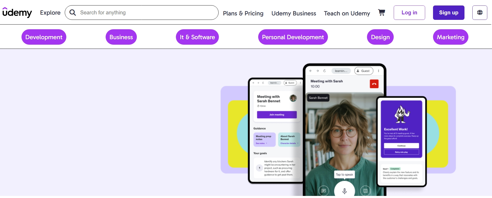
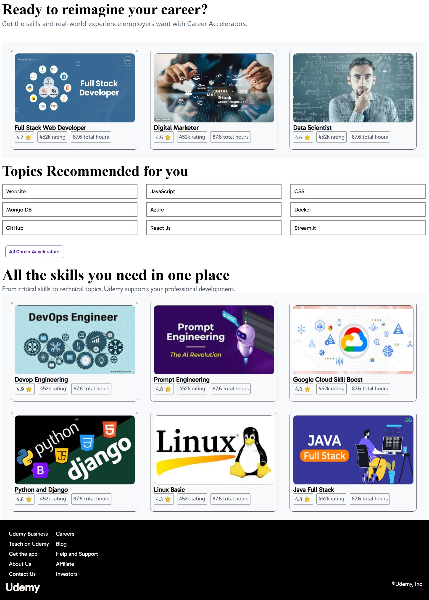

# Udemy Clone - HTML & CSS Project

 <!-- Add a screenshot if available -->

A responsive Udemy website clone built using pure HTML and CSS. This project demonstrates front-end web development skills by replicating the core visual elements of the Udemy learning platform.

## Features

- Responsive design that works on mobile, tablet, and desktop
- Navigation bar with logo, categories, search, and user options
- Course cards with hover effects
- Featured categories section
- Clean, modern UI similar to Udemy

## Technologies Used

- HTML5
- CSS3 (including Flexbox and CSS Grid)
- Responsive design principles
- No JavaScript (pure HTML/CSS implementation)

## Live Demo

Check out the live version of the project:  
[View Live Demo](https://uthragiri2005.github.io/udemy-clone-2/)

## Screenshots

<!-- Add your screenshots here if available -->
  


## How to Run Locally

1. Clone the repository:
   ```bash
   git clone https://github.com/uthragiri2005/udemy-clone-2.git
